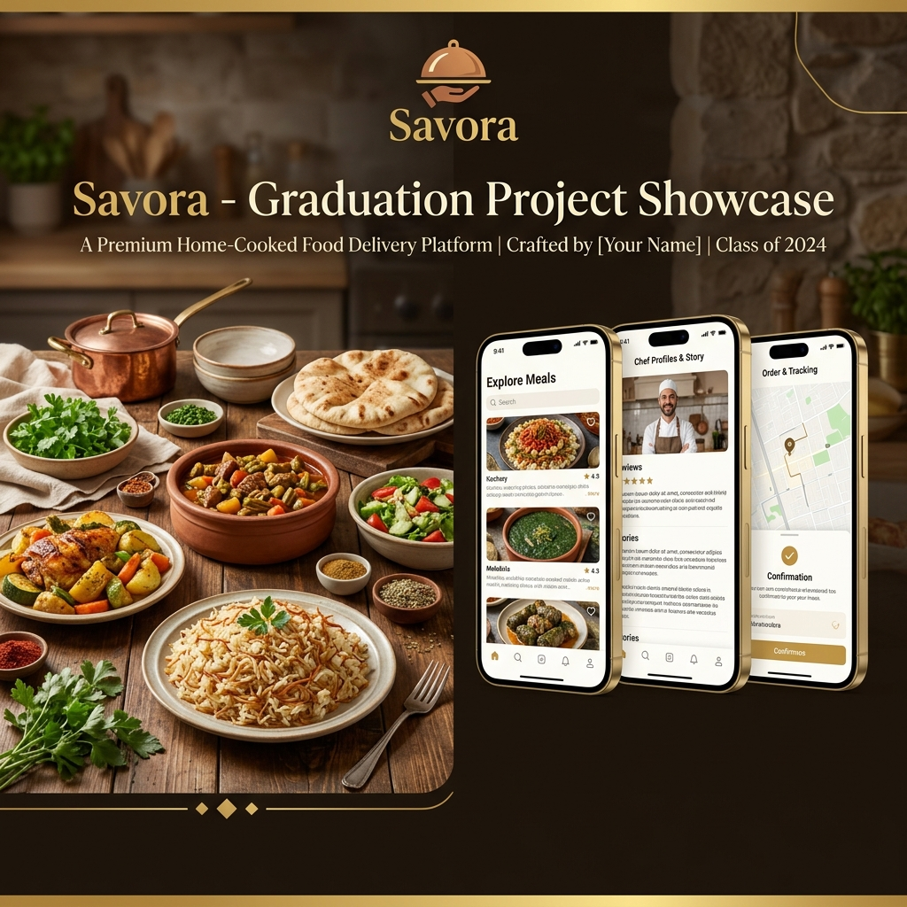

# Savora App - Graduation Project Styles Showcase

Here is the design representation and presentation banner for the **Savora Graduation Project**.

## 1. Graduation Project Banner
Below is the generated graduation project showcase banner for Savora:

*Located at:* `styles/banner.png`

---

## 2. Design System & Style Guide

### Color Palette

| Color | Hex Code | Usage |
| :--- | :--- | :--- |
| **Accent Gold** | `#E8A838` | Primary highlights, branding accents, rating indicators. |
| **Espresso Brown** | `#2C1810` | Dark mode background, primary headers, text colors. |
| **Cream White** | `#FDFBF7` | Light mode background, subtle cards, soft container fills. |

### Typography
*   **Brand Headers:** `Playfair Display` (Serif font for a luxury, premium look)
*   **Body & UI Text:** `DM Sans` / `Plus Jakarta Sans` (Clean, legible sans-serif font)
